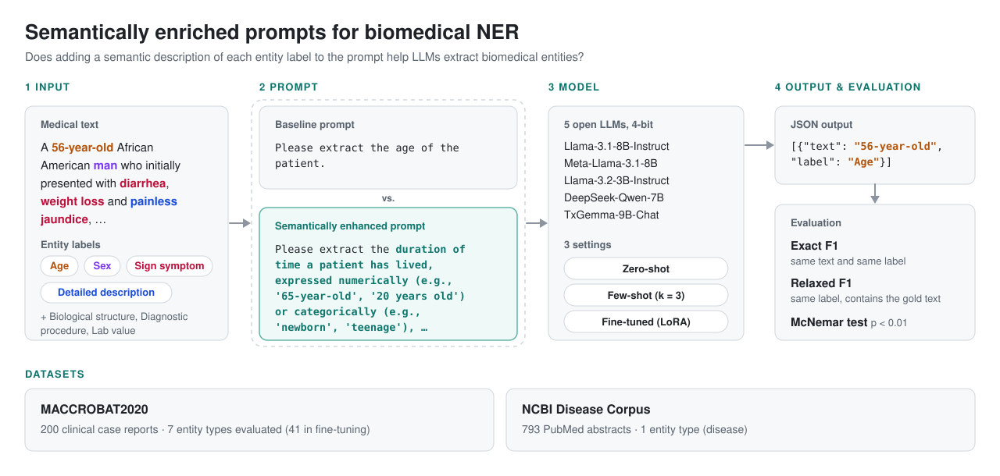

# Semantic prompting for biomedical named entity recognition

Code for the paper **"Large Language Models with Semantically Enriched Prompts for Biomedical Named Entity Recognition"** by Erik Calcina, Erik Novak, Dunja Mladenić and The PREPARE Project Group.



The code evaluates whether adding semantic descriptions of the entity labels to the prompt improves the NER performance of large language models. Each experiment compares a baseline prompt with a semantically enhanced prompt in three settings: zero-shot prompting, few-shot prompting and fine-tuning with LoRA.

## Repository structure

| Path | Content |
|---|---|
| `run_pipeline.sh` | one model on one dataset in one setting: [fine-tuning] → prediction → post-processing → evaluation → McNemar test |
| `run_all.sh` | all experiments of the paper (5 models × 2 datasets × 3 settings) |
| `scripts/train.py` | LoRA fine-tuning |
| `scripts/predict.py` | prediction with the zero-shot, few-shot and fine-tuning prompts |
| `scripts/postprocess.py` | removes empty entities and fixes label casing |
| `scripts/model_utils.py` | model and tokenizer loading, per-model chat-template handling |
| `prompts/baseline_prompts.json` | baseline prompts: instructions, label descriptions and few-shot examples |
| `prompts/semantic_prompts.json` | semantically enhanced prompts: instructions, semantic label descriptions and few-shot examples |
| `prompts/prompt_builder.py` | builds the zero-shot, few-shot and fine-tuning prompts from the two JSON files |
| `prompts/label_sets.py` | entity labels of each dataset |
| `evaluation/score.py` | Exact and Relaxed precision, recall and F1 |
| `evaluation/ner_metrics.py` | matching of predicted and gold entities |
| `evaluation/mcnemar.py` | McNemar test between the baseline and the semantically enhanced prompt |

## Installation

```bash
python -m venv venv
source venv/bin/activate
pip install -r requirements.txt
```

The experiments were run on a single NVIDIA L40S GPU with 48 GB of memory. All models are loaded in 4-bit precision. The Llama and TxGemma models are gated on Hugging Face, so log in first with `huggingface-cli login`.

## Data

The datasets are not included in this repository. Download them from the original sources:

* **MACCROBAT2020**: https://doi.org/10.6084/m9.figshare.9764942.v2
* **NCBI Disease Corpus**: https://www.ncbi.nlm.nih.gov/CBBresearch/Dogan/DISEASE/

MACCROBAT2020 was split at the document level into 80% training and 20% test documents, and the documents were then segmented into sentences. For the NCBI Disease Corpus, the official split was used. Each file is a JSON list with one entry per sentence:

```json
[
  {
    "text": "A 56-year-old African American man who initially presented with diarrhea ...",
    "labels": [
      {"text": "56-year-old", "label": "Age"},
      {"text": "man", "label": "Sex"},
      {"text": "diarrhea", "label": "Sign symptom"}
    ]
  }
]
```

The default file locations are:

```
data/train.llm.json                    # MACCROBAT2020 training set
data/test.llm.json                     # MACCROBAT2020 test set
data/NCBI/ncbi_sentences_train.json    # NCBI training set
data/NCBI/ncbi_sentences_test.json     # NCBI test set
```

Other locations can be set with `--train_file` and `--test_file`. MACCROBAT2020 labels are written as in the dataset (e.g. `Sign symptom`, `Biological structure`), and the NCBI label is `DISEASE`.

## Usage

One model, one dataset, one setting, both prompts:

```bash
./run_pipeline.sh --model meta-llama/Llama-3.1-8B-Instruct --dataset maccrobat --regime few-shot
./run_pipeline.sh --model google/txgemma-9b-chat --dataset ncbi --regime fine-tuned
```

All experiments of the paper:

```bash
./run_all.sh --out_dir runs
```

Results are written to `<out_dir>/<dataset>/<regime>/<baseline|semantic>/<model>/` (`predictions.json`, `scores.json`), and the McNemar test to `<out_dir>/<dataset>/<regime>/mcnemar/<model>.txt`. Run `./run_pipeline.sh --help` for all options.

## Prompts

`prompts/prompt_builder.py` builds the prompts exactly as they are listed in the appendix of the paper. In the zero-shot and few-shot settings, each label is extracted with a separate prompt. In the few-shot setting, the three examples are given as previous turns of the conversation. In the fine-tuning setting, all labels are extracted with a single prompt.

## Settings

| Parameter | Value |
|---|---|
| Few-shot examples | 3 per label (2 positive, 1 negative) |
| Temperature | 0.2 (zero-shot, few-shot), 0.1 (fine-tuned) |
| Top-p | 0.95 |
| Maximum generated tokens | 2,000 |
| LoRA | r = 16, α = 32, dropout 0.05, applied to the q, k, v, o, gate, up and down projections and the output layer |
| Training | 3 epochs, AdamW, learning rate 2e-4, batch size 4, seed 42 |

In the zero-shot and few-shot settings, MACCROBAT2020 is prompted one label at a time for the seven evaluated labels. In the fine-tuning setting, the model is trained to extract all 41 entity types in a single prompt. All settings are evaluated on the seven labels `Age`, `Sex`, `Biological structure`, `Sign symptom`, `Diagnostic procedure`, `Lab value` and `Detailed description`.

## Evaluation

* **Exact F1**: a prediction is correct if its text and label both match a gold entity.
* **Relaxed F1**: a prediction is correct if its label matches and its text contains the gold entity text.
* **McNemar test**: compares the baseline and the semantically enhanced prompt on the Exact matches (`--over-union`, Yates-corrected, significance level p < 0.01).
